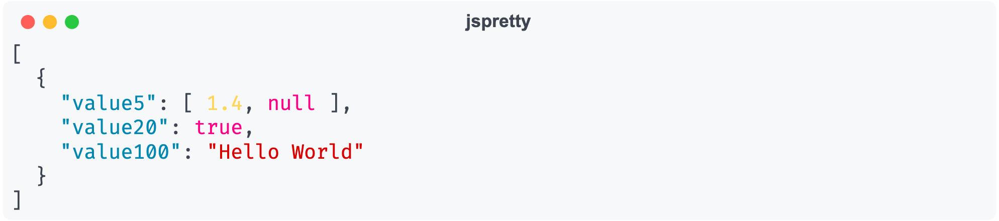

# jspretty

[jq](https://jqlang.github.io/jq/) does a great job of making JSON data readable. However for large and repetitive data some improvements can be made, eg inlining objects and arrays that only contain primitives and ordering keys by numeric value.

## Example

#### jspretty

<picture>
  <source media="(prefers-color-scheme: dark)" srcset="images/jspretty-dark.png">
  <source media="(prefers-color-scheme: light)" srcset="images/jspretty-light.png">
  
</picture>

#### jq (compact)

<picture>
  <source media="(prefers-color-scheme: dark)" srcset="images/jq-cS-dark.png">
  <source media="(prefers-color-scheme: light)" srcset="images/jq-cS-light.png">
  
</picture>

#### jq (pretty-printed)

<picture>
  <source media="(prefers-color-scheme: dark)" srcset="images/jq-S-dark.png">
  <source media="(prefers-color-scheme: light)" srcset="images/jq-S-light.png">
  
</picture>

## Usage

```
usage: jspretty.py [-h] [--max-inline-length MAX_INLINE_LENGTH] [--color | --monochrome]

Format JSON for improved ledgability

options:
  -h, --help            show this help message and exit
  --max-inline-length MAX_INLINE_LENGTH
                        Maximum length of inlined objects and arrays
  --color               colorise JSON
  --monochrome          monochrome (don't colorise JSON)
```
